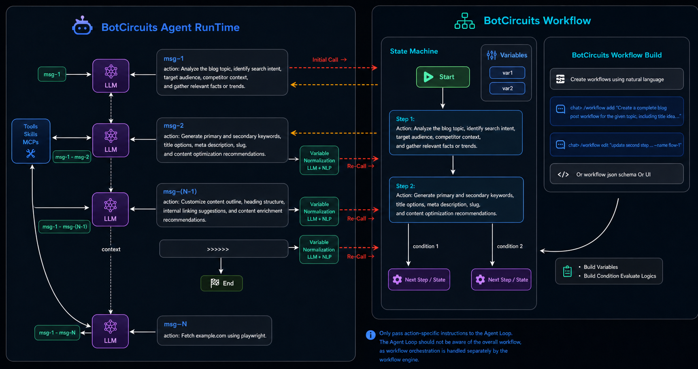

# botcircuits-agent

The workflow-native AI agent where an LLM handles the reasoning and tool calls for each step, while a deterministic state machine controls the overall flow. The result:predictable and token-efficient multi-step automation without depending on an LLM to drive everything.

 
---

## Quick Start

### Setup
#### Clone and install

```bash
# 1. Install uv (skip if you already have it)
curl -LsSf https://astral.sh/uv/install.sh | sh
# or: brew install uv

# 2. Clone the repo
git clone https://github.com/botcircuits-ai/botcircuits-agent
cd botcircuits-agent

# 3. Pick a Python (3.11+) and create the project venv
uv python install 3.11
uv venv --python 3.11        # creates ./.venv

# 4. Activate the venv
source .venv/bin/activate    # bash / zsh

# 5. Install dependencies into the venv
uv sync
```

Configure your provider, model, and API key:

```bash
botcircuits setup
```

The wizard walks you through provider (`anthropic` / `openai` / `gemini`), model, and API key with arrow-key navigation (↑/↓ to move, Enter to select, Esc to keep the current value). Each pick is saved as you go:

- `provider` and `model` → `~/.botcircuits/settings.json`
- API key → `~/.botcircuits/.env` (`ANTHROPIC_API_KEY` / `OPENAI_API_KEY` / `GEMINI_API_KEY`, file mode `0600`)

Re-running `botcircuits setup` shows your existing values as defaults, and an existing API key gives you a **Keep / Replace / Clear** choice instead of re-prompting for the secret.

| Form | What it does |
|---|---|
| `botcircuits setup` | Full wizard (currently the LLM section) |
| `botcircuits setup llm` | Just the LLM provider/model/API-key section |
| `botcircuits setup --user` | Write to `~/.botcircuits/` (default) |
| `botcircuits setup --project` | Write to `./.botcircuits/settings.json` (shared via VCS) |
| `botcircuits setup --local` | Write to `./.botcircuits/settings.local.json` (gitignored personal override) |

Prefer to configure by hand? Copy the env template instead:

```bash
cp .env.example .env
```

```bash
# .env — API key for the provider you want to use (required)
ANTHROPIC_API_KEY=...
OPENAI_API_KEY=...
GEMINI_API_KEY=...

# Optional — only used as a fallback when settings.json / CLI flags don't set them
LLM_PROVIDER=anthropic        # anthropic | openai | gemini
ANTHROPIC_MODEL=claude-opus-4-7
OPENAI_MODEL=gpt-4.1
GEMINI_MODEL=gemini-2.5-flash
```

Effective precedence (highest wins): **CLI flag → `settings.json` (layered) → env var → built-in default**.

### Run

Interactive CLI:

```bash
botcircuits
botcircuits --provider openai
```

Pipe a single message (non-interactive):

```bash
echo "what is 2+2?" | botcircuits --no-stream
```

FastAPI gateway (for HTTP + messaging channels):

```bash
uv run uvicorn botcircuits.gateway:app --reload --port 8000
# or
botcircuits-gateway
```

#### Useful CLI flags

| Flag | Description |
|---|---|
| `--provider` | `anthropic` (default) \| `openai` \| `gemini` |
| `--model` | Override the provider's default model |
| `--stream` / `--no-stream` | Force streaming on/off |
| `--auto` | Skip y/N confirmation on every gated tool. A warning still prints before each action. |
| `--config <path>` | Load a specific `settings.json` (in addition to the auto-discovered files) |

#### Settings files (optional)

The CLI auto-loads these in order (later layers win):

| Layer | Path |
|---|---|
| User | `~/.botcircuits/settings.json` |
| Project (shared) | `.botcircuits/settings.json` |
| Project (local) | `.botcircuits/settings.local.json` (gitignored) |

CLI flags always win over JSON. A starter file is at [.botcircuits/settings.example.json](.botcircuits/settings.example.json).

#### Slash commands inside the CLI

| Command | Action |
|---|---|
| `/help` | Show all commands |
| `/reset` | Clear the current session and start fresh |
| `/session [id]` | Show or switch session id |
| `/stream on\|off` | Toggle streaming |
| `/tools` | List the tools the model can call |
| `/skills` | List filesystem skills |
| `/memory` | Show persistent memory |
| `/workflow add "<prompt>"` | Author a new workflow from natural language |
| `/workflow edit "<prompt>" --name <wf>` | Edit an existing workflow |
| `/workflow run --name <wf> [--initial-args '{"k":"v"}']` | Force-start a workflow tool, bypassing the model's tool choice |
| `/quit` | Exit |

Type `"""` on its own line to start (and again to end) a multi-line message.

---

## Workflow

A **workflow** is a step-by-step conversation script the agent can run on your behalf. Each workflow is one JSON file that lives under `.botcircuits/workflows/`, and once the agent loads it the workflow becomes a tool the model can call by name.

### Authoring from the CLI

You don't have to hand-edit JSON. Drive everything through the `/workflow` slash command:

```
botcircuits
```
```
/workflow add --name workflow_demo "Create a workflow with 11 steps total (step_1 through step_10 plus an end step) that takes one initial argument end_id (a string like 'step_3' or 'step_7' controlling early termination); each numbered step's action is 'Create a markdown file named <step_id>.md in the current directory containing the current step number and current date and time, e.g., step_3 creates step_3.md with content: Step 3 — <current date and time>'; step_1 through step_9 each have a branching condition: if end_id equals the current step id go to the end step, otherwise go to the next numbered step (step_1 → end if end_id==step_1 else step_2, step_2 → end if end_id==step_2 else step_3, ... through step_9 → end if end_id==step_9 else step_10); step_10 has no condition and goes directly to the end step after its action; the end step's action is 'Create a markdown file named end.md in the current directory containing exactly: END'."
```

The agent drafts the workflow, shows you a preview, asks `y/N`, writes the file, and registers it as a tool. The new workflow becomes callable on the very next message — no restart.

By default the model picks a slug for the workflow `name`. Pass `--name <wf>` to set it yourself — that value becomes both the JSON filename (`.botcircuits/workflows/<wf>.json`) and the registered tool name:

```
/workflow add "<prompt>" --name check_order_status
```

`--name` must be slug-safe (letters, digits, `_`, `-`).

To change an existing workflow:

```
/workflow edit "also handle refunds" --name check_order_status
```

The agent reads the current file, applies your edit, asks `y/N`, and refreshes the live tool.

### Force-running a workflow

When you don't want to leave it up to the model to decide whether to invoke a workflow, kick one off directly:

```
/workflow run --name workflow_demo
/workflow run --name workflow_demo --initial-args '{"end_id":"step_3"}'
```

This calls the workflow tool right away with the args you supplied, seeds the conversation with the resulting first step, and hands control back to the model to perform it. `--initial-args` must be a JSON object; omit it to start with `{}`. The target workflow must already be registered — workflow tools are auto-discovered from `.botcircuits/workflows/.build/` and the command refreshes that registry before looking up the name, so a freshly authored workflow works without a restart.

### Where workflows live

By default, workflows live in `.botcircuits/workflows/*.json` under the current directory. Override with `BOTCIRCUITS_WORKFLOWS_DIR=/abs/path` (or set it in `.env`). A missing directory just means "no workflows" — drop a folder in to opt in.

Each file is one workflow record:

```json
{
  "name": "greet_user",
  "description": "Greet the caller, then say goodbye.",
  "flow": {
    "start": "s0",
    "steps": {
      "s0": { "type": "start", "next": "a1" },
      "a1": {
        "type": "agentAction",
        "next": "a2",
        "conditions": [
          { "condition": "the requested tone is warm", "next": "a2" }
        ],
        "settings": {
          "action": "Capture the desired tone and greet the user accordingly."
        }
      },
      "a2": {
        "type": "agentAction",
        "settings": { "action": "Say goodbye." }
      }
    }
  }
}
```

`name` doubles as the tool name the model calls; it must match `^[a-zA-Z0-9_-]+$`. Only `start` and `agentAction` step types are supported — to branch, attach a `conditions` list at the step root (sibling of `type` and `next`, not nested inside `settings`). `conditions` is control flow, so it sits next to the other control-flow fields rather than with the step-type-specific payload in `settings`.

### Building a workflow

The raw file you author is *not* what the engine runs. The `workflow build` step takes the natural-language `conditions` on each `agentAction` and **prepares conditions and variables** the engine can evaluate deterministically:

- **Conditions** — each NL `condition` (e.g. `"the requested tone is warm"`) is compiled into a typed `choices[]` entry with an operator (`is`, `>=`, `contains`, …) and a value, so the engine can pick the matching branch without re-calling the LLM at runtime.
- **Variables** — an aggregated `flow.variables` list is emitted, naming every slot referenced by the compiled conditions along with its inferred `dataType` and a short description. The runtime uses this list to coerce the LLM's free-text args into the right shape before evaluating branches.

`/workflow add|edit` runs the builder for you. If you hand-edit a workflow file, re-build it from the CLI:

```bash
botcircuits workflow build --name=greet_user
```

The agent runtime only loads workflows from `.botcircuits/workflows/.build/`, so a workflow that hasn't been built isn't callable — `workflow build` is what produces the runnable copy.

---

## Skills

A **skill** is a small folder of instructions (and optionally allowed tools) the agent reads from disk. Skills are useful for capturing repeatable patterns — "how we answer support questions", "how we draft a PR description" — without baking them into the system prompt.

### Where skills live

The CLI discovers skills from:

- `skills/` (project)
- `.botcircuits/skills/` (project)

Each skill is a folder with a `SKILL.md` file:

```
skills/
└── botcircuits-faq/
    └── SKILL.md
```

```markdown
---
name: botcircuits-faq
description: Answer questions about BotCircuits — features, pricing, docs.
allowed-tools: playwright__browser_navigate, playwright__browser_snapshot
---

You do NOT know about BotCircuits from prior knowledge. The only source of
truth is https://botcircuits.ai/. Fetch the site before answering...
```

The `description` is what the model uses to decide when to invoke the skill. `allowed-tools` (optional) restricts which tools the skill is allowed to call during its run.

### Listing and running

```
/skills              # list discovered skills
/<skill-name>        # run a skill directly (bypass the model)
```

The agent can also pick a skill on its own based on the description.

---

## MCP

[MCP](https://modelcontextprotocol.io) servers expose external tools (filesystem, GitHub, databases, …) to the agent. You can configure them once and they become available across every CLI session and gateway request.

### Where MCP servers live

MCP server configs live in `mcp.json` files, layered the same way as `settings.json`:

| Layer | Path |
|---|---|
| User | `~/.botcircuits/mcp.json` |
| Project (shared) | `.botcircuits/mcp.json` |
| Project (local) | `.botcircuits/mcp.local.json` (gitignored) |

Two modes:

- **`local`** — the agent runs the MCP server in-process. Works with every provider, including Gemini.
- **`hosted`** — the provider executes the MCP server itself (Anthropic and OpenAI only). Gemini auto-promotes hosted entries to local.

### Managing from the CLI

```bash
# List configured servers
botcircuits mcp list

# Add a local stdio server (writes to .botcircuits/mcp.json)
botcircuits mcp add fs \
    --mode local --transport stdio --command npx \
    --args -y @modelcontextprotocol/server-filesystem /tmp

# Add a hosted server to your user-wide mcp.json
botcircuits mcp add github --user \
    --mode hosted --url https://api.githubcopilot.com/mcp/ \
    --authorization-token "$GITHUB_PAT"

# Personal override that won't be committed (auto-added to .gitignore)
botcircuits mcp add fs-debug --local \
    --mode local --transport stdio --command npx --args -y debug-fs /tmp

# Connect, list tools, disconnect — verifies a local server works
botcircuits mcp test fs

# Remove a server
botcircuits mcp remove github
```

If a flag value starts with `-`, use the `--flag=value` form (e.g. `--args=-y,pkg,/tmp`) so argparse doesn't read it as a flag.

---

## Tools

The agent ships with a set of built-in tools so the model can read files, run commands, search code, and keep a TODO list. Run `/tools` inside the CLI to see what's currently loaded.

| Tool | What it does | Gate |
|---|---|---|
| `now` | Current UTC time (ISO 8601) | — |
| `read_file` | Read a UTF-8 text file | — |
| `write_file` | Create or overwrite a file | y/N + preview |
| `edit_file` | Exact string-replace in a file | y/N + unified diff |
| `list_dir` | List a directory | — |
| `glob_search` | Find files by glob (`**/*.py`) | — |
| `grep_search` | Regex search across files | — |
| `todo_write` | Maintain a live TODO list | — |
| `plan_and_confirm` | Present a plan and gate execution | y/N + plan preview |
| `shell_exec` | Run a system command (background mode supported) | y/N + argv preview |
| `shell_status` | Poll a background process | — |
| `shell_stop` | Terminate a background process | y/N |
| `memory` | Read/write the persistent agent memory | — |
| `build_workflow` | Author a workflow JSON. **Loaded on demand** via `/workflow add\|edit`. | y/N + workflow preview |

There is no shell expansion — `shell_exec` takes an `argv` list, so pipes/redirects/globs don't work; the model has to break the command apart itself.

### Approving gated actions

Before any gated tool runs, the agent pauses and shows you what it's about to do:

```
  ▸ shell_exec proposes:
      cmd:  git status
      run? [y/N]:
```

Press `y` (or `yes`) to allow, Enter (or anything else) to deny. A denied tool returns `{"denied": true, ...}` to the model along with a hint not to retry.

### Auto mode

`--auto` (or `tools.<name>.auto: true` in `settings.json`) skips the y/N prompt. A warning banner still prints so you can see what ran:

```
  ⚠ shell_exec running (auto mode):
      cmd:  git status
```

Non-interactive contexts (the gateway, piped stdin) engage auto mode automatically — otherwise every gated tool would deadlock waiting for input that never arrives.

### Tuning or disabling tools

Per-tool config lives under a `tools` block in any `settings.json`:

```json
{
  "tools": {
    "shell_exec": { "timeout_seconds": 60, "max_output_bytes": 20000 },
    "write_file": { "auto": false, "max_bytes": 2000000 },
    "now": null
  }
}
```

- A dict → override the tool's defaults.
- `null` or `false` → disable the tool entirely.
- Omitted → keep the built-in defaults.

Unknown tool names or unknown keys are rejected at startup with a clear error.

---

## Message Gateway

The same FastAPI process can connect the agent to messaging platforms. One process can serve WhatsApp, Slack, generic webhooks, and a built-in cron scheduler — all routed through the same agent and conversation store.

```bash
uv run uvicorn botcircuits.gateway:app --reload --port 8000
```

### Supported channels

| Channel | Inbound | Outbound |
|---|---|---|
| WhatsApp | Meta Cloud API webhook (`POST /messaging/whatsapp`) | Graph API |
| Slack | **Socket Mode** (outbound WebSocket — no public URL required) | `chat.postMessage` |
| Webhook | `POST /messaging/webhook` (Bearer auth) | POST to a configured `outbound_url` (optional) |
| Cron | Synthesized every 60 seconds | Logged, or forwarded to another channel |

Each user gets an independent conversation history per channel — sessions are keyed by `{channel}:{external_chat_id}`.

### Enabling a channel

A channel registers automatically when its credentials are present. Anything left blank is skipped silently.

```bash
# WhatsApp (all three required to enable)
WHATSAPP_PHONE_NUMBER_ID=123456789
WHATSAPP_ACCESS_TOKEN=EAA…
WHATSAPP_VERIFY_TOKEN=any-shared-secret      # echoed back during Meta's GET verify

# Slack — Socket Mode (no public URL required)
SLACK_BOT_TOKEN=xoxb-…                       # bot token, for chat.postMessage
SLACK_APP_TOKEN=xapp-…                       # app-level token, scope: connections:write

# Generic webhook
WEBHOOK_OUTBOUND_URL=https://your-app.example.com/incoming   # optional
WEBHOOK_TOKEN=shared-bearer-token                            # optional (recommended)
```

Check which channels are live:

```bash
curl http://localhost:8000/messaging/status
```

### Platform setup notes

**WhatsApp.** In the Meta WhatsApp Business app, set the webhook URL to `https://<your-host>/messaging/whatsapp` and the verify token to whatever you put in `WHATSAPP_VERIFY_TOKEN`. Subscribe to the `messages` field on the WhatsApp Business Account.

**Slack (Socket Mode).** Create a Slack app, enable Socket Mode, and generate an app-level token with `connections:write` (→ `SLACK_APP_TOKEN`). Add bot scopes `chat:write`, `channels:history`, `groups:history`, `app_mentions:read`, `im:history`, `im:write`, `users:read` and install the workspace (→ `SLACK_BOT_TOKEN`). Subscribe to bot events `message.im`, `message.channels`, `message.groups`, `app_mention`. Missing `message.channels` / `message.groups` is the most common setup mistake — the bot will reply in DMs but appear dead in channels.

**Generic webhook.**

```bash
curl -X POST http://localhost:8000/messaging/webhook \
  -H "authorization: Bearer $WEBHOOK_TOKEN" \
  -H "content-type: application/json" \
  -d '{"chat_id": "user-42", "text": "What is the weather like?"}'
```

If `WEBHOOK_OUTBOUND_URL` is set, the gateway posts the agent's reply back to that URL with the same bearer token.

### Cron scheduler

The cron channel ticks every 60 seconds. Each due job synthesizes an inbound message — the agent treats it like a user request and the reply is either logged or forwarded to another channel. Jobs live in `.botcircuits/messaging.json`:

```json
{
  "cron": {
    "enabled": true,
    "jobs": [
      {
        "name": "daily-standup",
        "prompt": "Summarize yesterday's merged PRs and post a standup.",
        "schedule": "0 9 * * 1-5",
        "deliver_to_channel": "slack",
        "deliver_to_chat_id": "C0123456789"
      },
      {
        "name": "hourly-health",
        "prompt": "Check the production health endpoint and report anomalies.",
        "schedule": "0 * * * *"
      }
    ]
  }
}
```

Schedules use standard 5-field cron expressions evaluated in **UTC** (`*`, literals, `A-B` ranges, `*/S` steps, comma lists). Day-of-week accepts `0` or `7` for Sunday.

### Terminal
##### SSH ( TODO )
##### Docker ( TODO )

### Deployment
##### Docker-Compose ( TODO )
##### Kubernetes ( TODO )

## License
Licensed under the Apache License, Version 2.0 [LICENSE](LICENSE)

## Built by [BotCircuits](https://botcircuits.ai)
